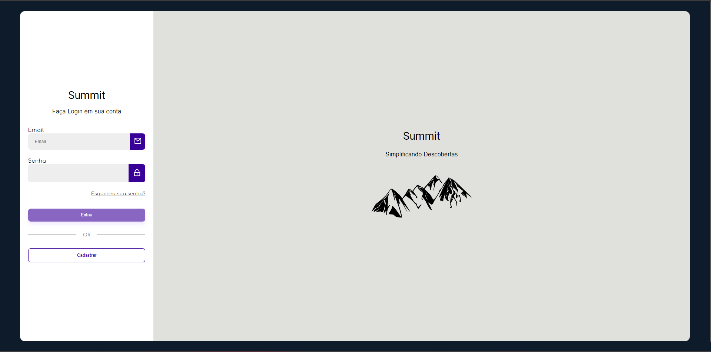
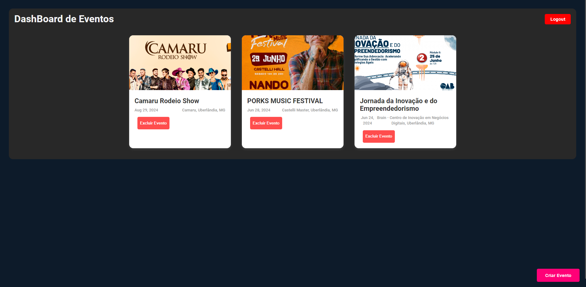
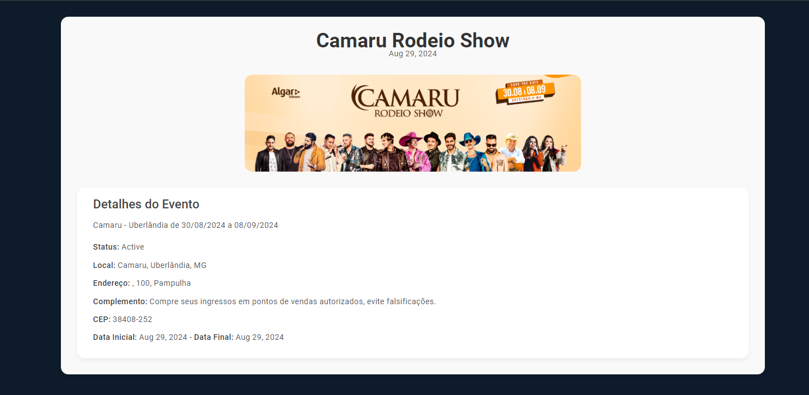
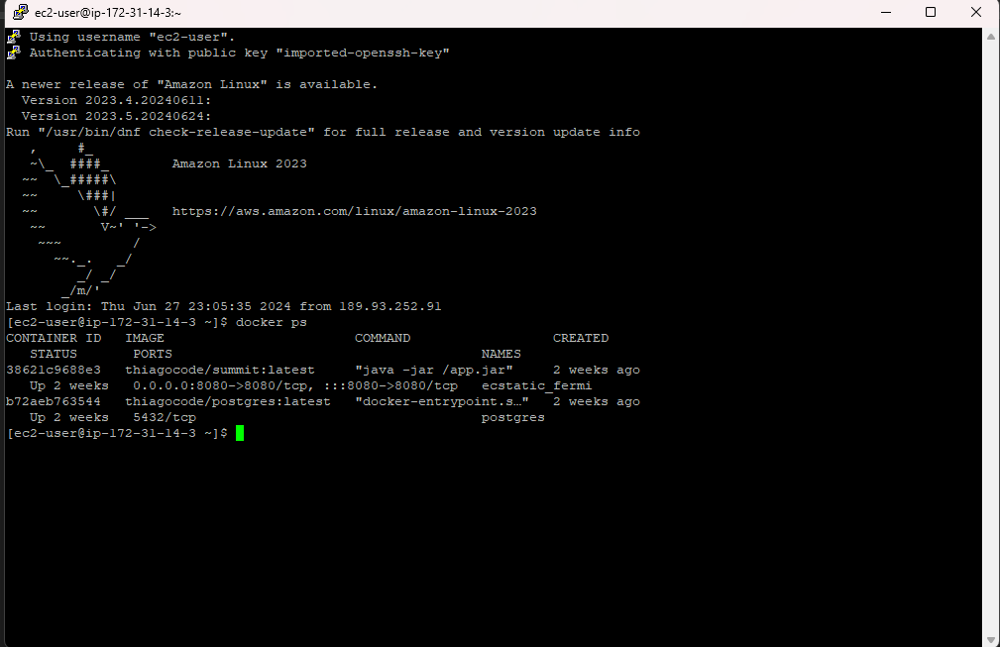

# Summit-Web-AngularJS

Summit é uma solução inovadora para quem busca explorar eventos de entretenimento de maneira prática e interativa. Esta versão web permite aos donos de eventos cadastrar e gerenciar seus eventos. A aplicação Angular se comunica com uma API e um banco de dados hospedados na AWS.

## Visão Geral

Esta aplicação web foi desenvolvida utilizando Angular, permitindo aos organizadores de eventos criar, visualizar e gerenciar seus eventos. A aplicação interage com uma API e um banco de dados hospedados na AWS.

## Funcionalidades

- **Registro de Usuários**: Permite que novos usuários se registrem.
- **Login de Usuários**: Autentica os usuários e armazena tokens de autenticação.
- **Criação de Eventos**: Organiza e cria novos eventos, incluindo o upload de banners e informações detalhadas.
- **Visualização de Eventos**: Exibe a lista de eventos disponíveis e seus detalhes.
- **Exclusão de Eventos**: Permite que os organizadores excluam eventos.
- **Notificações**: Fornece feedback visual para ações bem-sucedidas e erros.

## Tecnologias Utilizadas

- **Angular**: Framework para construção da interface do usuário.
- **Angular Router**: Para navegação entre componentes.
- **Reactive Forms**: Para manipulação e validação de formulários.
- **RxJS**: Para manipulação de operações assíncronas.
- **Ngx-Toastr**: Para exibição de notificações.
- **API REST**: Desenvolvida e hospedada na AWS.
- **Banco de Dados**: Hospedado na AWS.

## Instalação

Siga estas etapas para configurar o projeto localmente:

1. Clone o repositório:
   ```bash
   git clone https://github.com/Thiagof2755/Summit-Web-AngularJS.git
   cd Summit-Web-AngularJS
   ```

2. Instale as dependências:
   ```bash
   npm install
   ```

3. Execute a aplicação:
   ```bash
   ng serve
   ```

4. Abra o navegador e acesse:
   ```
   http://localhost:4200
   ```

## Estrutura do Projeto

- **src/app/services**: Contém os serviços para comunicação com a API.
  - `register.service.ts`: Serviço de registro de usuários.
  - `login.service.ts`: Serviço de autenticação de usuários.
  - `event.service.ts`: Serviço de gerenciamento de eventos.
  - `auth.service.ts`: Serviço de autenticação.

- **src/app/components**: Contém os componentes da aplicação.
  - `register-event`: Componente para criação de novos eventos.
  - `register`: Componente de registro de usuários.
  - `login`: Componente de login de usuários.
  - `home`: Componente de exibição de lista de eventos.
  - `event-detail`: Componente de exibição de detalhes de eventos.

## Telas de Exemplo

### Tela de Login


### Dashboard


### Detalhes do Evento


## Hospedagem na AWS

A aplicação Angular se comunica com uma API REST e um banco de dados hospedados na AWS, proporcionando uma infraestrutura escalável e confiável para o gerenciamento de eventos.

### Container AWS


## Contribuição

Sinta-se à vontade para contribuir com o projeto. Para isso:

1. Faça um fork do projeto.
2. Crie uma nova branch:
3. Commit suas alterações:
4. Envie suas alterações:
5. Abra um pull request.

## Licença

Este projeto está licenciado sob a MIT License.

Agradecemos a todos que contribuíram direta ou indiretamente para o desenvolvimento deste projeto.
